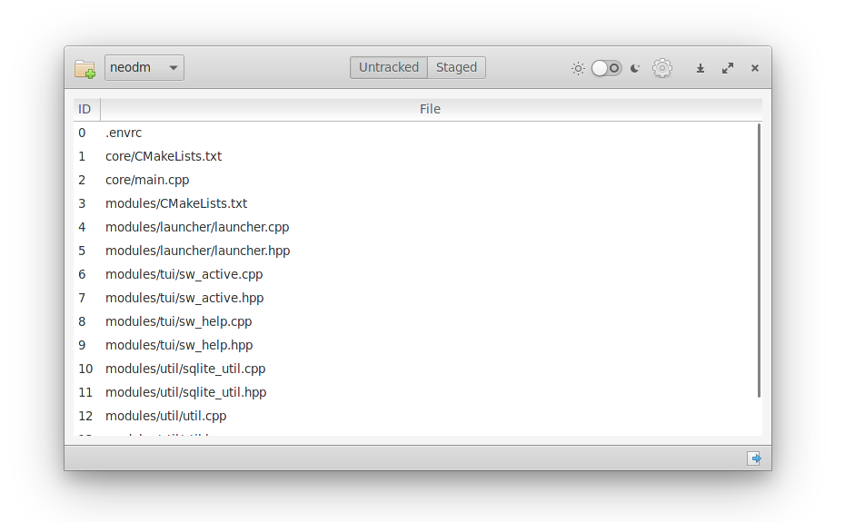
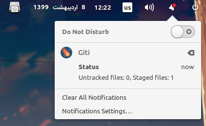

<h4 align="center">
    
</h4>

<h4 align="center">
      
</h4>

<h1 align="center">
    
</h1>

## A long time ago..
I had many projects on my machine.
Some of them were managed by git.
After a while, I accidentally lost all of my data.
I rarely staeg/commit/pushed my changes to github/gitlab, since i didn't thought someday my machine will broke and all of my efforts will be destroyed! (TBH, i was a lazy man!)

After that tragic event, i decided to stage/commit/push my changes more regularly. But i had still one issue.

I didn't know which projects have staged files or untracked files.(Except that by examining each of them separately)

I wanted a solution that __monitor__ my directories and notify me about latest changes.

So, This is exactly when i created giti.

## How giti works?
1. You add some git based directories.
2. Giti periodically monitor changes in your repos and send system notifications.(every 10 minutes by default. But you can change it or disable it by setting it to 0)
<h4 align="left">
    
</h4>

Tip: This application uses [libgit2-glib](https://github.com/GNOME/libgit2-glib) binding in vala language called [Ggit](https://valadoc.org/libgit2-glib-1.0/Ggit.html) to list untracked and staged files.

### Extra features
1. Giti can show you __Untracked__ and __Staged__ files in separate tabs.(This will help you to track changes easily)
2. You can __stage__ untracked files and also __commit__ staged files by pressing buttons that exist in the bottom of each page.

## Installation

### Install it from source
You can install giti by compiling from source, here's the list of dependencies required:

#### hostmake dependencies:
 - `ninja`
 - `meson`
 - `vala`

#### buildtime dependencies:
 - `gtk+-3.0`
 - `libgit2-glib-1.0`
 - `gee-0.8`
 - `granite`

#### Building
```
meson build --prefix=/usr
sudo ninja -C build install
```
And finally, run it:

`com.github.linarcx.giti`

### Distributions
#### Void

There is a work-in-progress Pull-Request:

https://github.com/void-linux/void-packages/pull/21327


### Tip for Windows-manager's Users
Notice that, giti uses [GLib.Notification](https://valadoc.org/gio-2.0/GLib.Notification.html) internally. So users should install a `notification agent` to get notificaitons. (like: notify-osd, ...)


## What does giti mean?
It's a persian word meaning universe:
> گیتی یا جهان عبارت است از کل زمان و فضا و محتویات آن که شامل سیارات، اقمار، ریزسیارات، ستارگان، کهکشانها و محتویات فضای میان کهکشانی و در واقع کل ماده و انرژی و هرآنچه به آن مربوط است، می‌شود.

## TODO
- [ ] Create statistic page that will show all changes in all directories at a glance!
- [ ] Remember the theme and default directory. (via: gsettings)
- [ ] Revert back latest commit to stage area. (via: `git reset --soft HEAD^`)

## License

