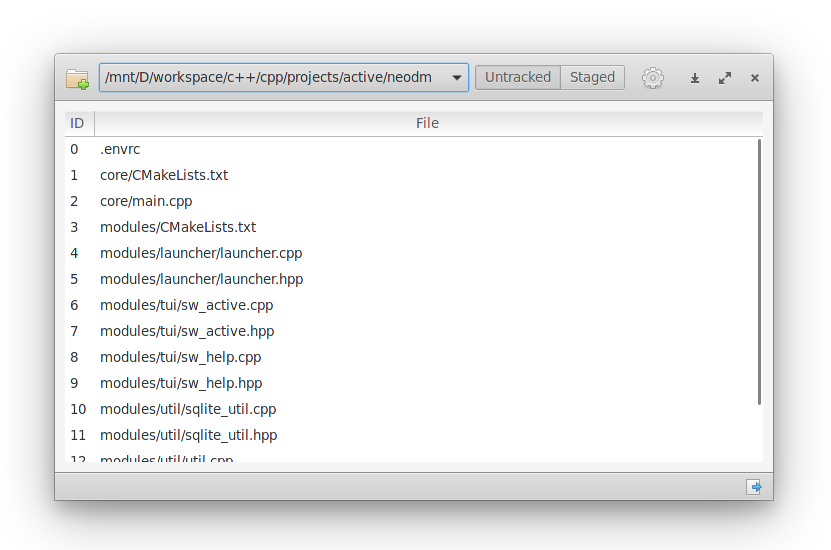

<h4 align="center">
    
</h4>

<h4 align="center">
          
</h4>

<h1 align="center">
    
</h1>

## A long time ago..
I had many projects on my computer some of which were managed by git. After a couple of months, I accidentally lost all of my data and projects.
And this gave me a good motivation to start a project that monitors my projects and reports me the changes periodically.

## Features
Watches __.git__ directories on your computer and periodically reports the latest changes popping up a window titled: __status_window__.

You can adjust the interval as most convenient for you.

## Installation
### Void [WIP]

### Arch [WIP]

## Install it from source
You can install giti by compiling from source, here's the list of dependencies required:
 - `gtk+-3.0`
 - `libgit2-glib-1.0`
 - `gee-0.8`
 - `glib-2.0`
 - `gobject-2.0`

runtime dependencies:
 - `ninja`
 - `meson`
 - `valac`

## Building
```
meson build --prefix=/usr
sudo ninja -C build install
```
And finally, run it:

`com.github.linarcx.giti`

## License

